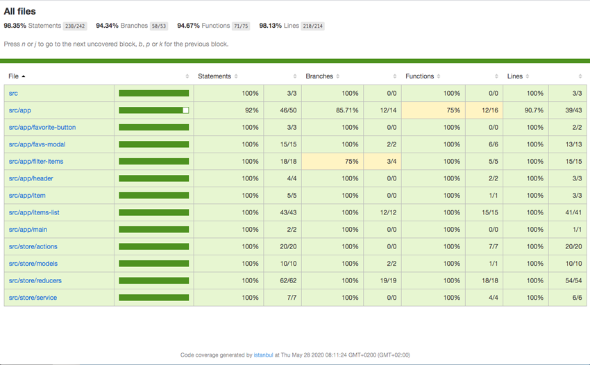

# ItemManager

Project where you will find an example that how to manage a itemlist with filter and favorites handling.
The project was build with the latest technology on Angular with version 9, using redux.

## Development server

Run `ng serve` for a dev server. Navigate to `http://localhost:4200/`. The app will automatically reload if you change any of the source files.

## Build

Run `ng build` to build the project. The build artifacts will be stored in the `dist/` directory. Compiled code is build in ES5 compatibility and is compatible oldest browsers as IE 11.

## Running unit tests

Run `ng test` to execute the unit tests via [Karma](https://karma-runner.github.io). The code is hightly coveraged and you could view the results by file stored in `coverate/index.html`.

## Further help

Jordi López Galera<[jordi8284@gmail.com](mailto:jordi8284@gmail.com)>;

Thanks and enjoy
